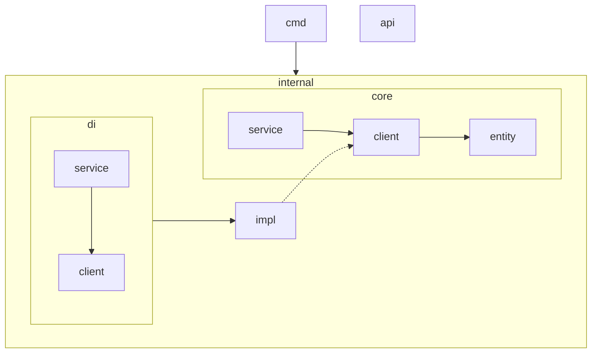

# typek8s/package: Development Guidelines and Architecture

## Overview

- **Project name**: typek8s/package
- **Purpose**: A TypeScript tool that generates TypeScript type definitions from Kubernetes OpenAPI schemas. It can
  fetch schemas from a running Kubernetes server or read from local OpenAPI files, then convert them into strongly-typed
  TypeScript interfaces.

## Architecture

Dependency relationship overview (arrows indicate direction of dependencies). Maintain clear boundaries and
responsibilities for each layer.

### Layers

**core** — The heart of the application (entities, business logic, abstractions). External services and complex I/O are
abstracted through `client` interfaces.

- `entity`: Core entities and helper functions (e.g., `apiVersionToFileName`).
- `client`: Abstract interfaces that define contracts for external dependencies (e.g., `K8sClient`, `FileIOClient`,
  `ParameterClient`). These interfaces define input/output operations aligned with core models.
- `service`: Business logic implementation that orchestrates `client` interfaces and `entity` utilities (e.g.,
  `AppService` handles the workflow of fetching OpenAPI schemas and generating TypeScript files).

**impl** — Implementation layer for `core/client` interfaces.

**di** — Dependency injection wiring. Combines `impl` implementations and wires them into `app` abstractions.

- `client`: Instantiates and exports concrete client implementations that satisfy `core/client` interfaces.
- `service`: Creates service instances with injected dependencies from `di/client`.

**cmd** — CLI entry point. Uses dependency-injected services from `di` to execute the application.

**api** — Auto-generated TypeScript type definitions from Kubernetes OpenAPI. Expected to be imported by users. Do not
read this directory when you develop in typek8s/package/ directory.

## Development

- `deno task tidy`: Run type checking, linting, and formatting. Keep the codebase free of compilation and lint errors.

## Coding Conventions

- **Language**: TypeScript (Deno runtime)
- **Naming**:
  - Classes, Interfaces, Types: PascalCase (e.g., `AppService`, `K8sClient`)
  - Functions, Variables: camelCase (e.g., `getAllOpenApi`, `serverBaseUrl`)
  - Constants: UPPER_SNAKE_CASE (e.g., `DEFAULT_TIMEOUT`)
  - Files/Directories: kebab-case (e.g., `file-io-client.ts`, `k8s-util.ts`)
- **Architecture principles**:
- Business logic belongs in `service` and `entity`
  - External systems must be abstracted through `client` interfaces
  - Concrete implementations go in `impl`
  - Dependency injection happens in `di`
- **NEVER** import from `impl` directly in `core` - always go through `di`
- **Import paths**: Use `mod.ts` for export and `deps.ts` for import which exist in each directory.

## Implementation Guidelines

- **Follow the established architecture**: Always keep the layered architecture in mind. When adding new features:
  1. Define abstractions in `core/client` if external dependencies are needed
  2. Implement business logic in `core/service`
  3. Create concrete implementations in `impl`
  4. Wire dependencies in `di`
  5. Use from `cmd` or future `api` layer
- **Mimic existing patterns**: Study and follow existing implementations when adding new code
- **Quality checks**: Run `deno task tidy` before committing to ensure:
  - No compilation errors
  - No lint errors
  - Code is properly formatted

## Key Concepts

### How It Works

1. **Input**: The tool accepts either:
   - A Kubernetes server base URL (fetches all OpenAPI schemas from the cluster)
   - A local OpenAPI file path + specific API version
2. **Processing**:
   - For server mode: Fetches OpenAPI schemas from `/openapi/v3` endpoint
   - For file mode: Reads the specified OpenAPI file
   - Parses OpenAPI JSON and filters resources by API version
   - Uses `openapi-typescript` to convert OpenAPI schemas to TypeScript types
   - Generates typed interfaces with `x-kubernetes-group-version-kind` metadata
3. **Output**: Writes TypeScript files named by API version (e.g., `apps.v1.ts`, `storage.k8s.io.v1.ts`)

### API Version Handling

Kubernetes API resources are versioned (e.g., `v1`, `apps/v1`, `storage.k8s.io/v1`). This tool:

- Converts API versions to file names using dot notation (e.g., `apps/v1` → `apps.v1.ts`)
- Filters OpenAPI schemas to include only resources matching the target API version
- Exports a default `api` interface with all resource types from that version

## External Dependencies

- **openapi-typescript**: Library for converting OpenAPI schemas to TypeScript types
- **Kubernetes API**: Source of OpenAPI schemas (when using server mode)
- **Deno runtime**: TypeScript runtime and tooling
